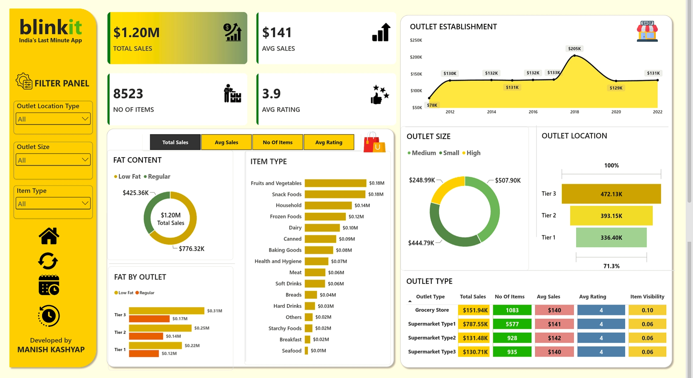

<p align="center">
  
</p>

<h1 align="center">📊 Blinkit Sales & Outlet Performance Dashboard</h1>

<p align="center">
  <b>Power BI Business Intelligence Project Report</b><br>
  Prepared from the supplied PBIX model, project requirements and dashboard view
</p>

---

## 📌 Project Overview

This project is a **Blinkit Sales Analysis Power BI Project** developed using **Microsoft Power BI**.
<div align="center">
  <h2>📊 Blinkit Sales Analysis — Power BI Project</h2>
  
  <p>
    
    
    
  </p>
  
  <p>
    
  </p>
</div>


## 🎯 Project Objectives

The main objectives of this project are to:

- 🛒 Analyze **Total Sales** and **Average Sales**
- 📦 Count **Number of Items** and **Average Rating**
- 🥑 Analyze sales by **Item Fat Content**
- 🍎 Identify top **Item Types**
- 🏪 Analyze sales by **Outlet Size** and **Outlet Location**
- 📅 Track **Outlet Establishment** trends over years
- 🏬 Compare **Outlet Types** on sales, items, ratings, and visibility
- 👁️ Evaluate **Item Visibility** as an operational KPI
- 💡 Generate actionable business recommendations

---

## 📁 Dataset Information

| Attribute | Details |
|-----------|---------|
| 🛒 Dataset | BlinkIT Grocery Data |
| 🗄️ Database | Power BI (PBIX) |
| 💻 Language | DAX / Power Query |
| 📊 Analysis Type | Exploratory & Business Analysis |
| 📌 Total Problems | 10+ Business Insights |
| 🌍 Domain | Retail / Grocery / Quick Commerce |
| 🛠️ Tool | Microsoft Power BI Desktop |

---

## 🗂️ Data Model & Analytical Structure

The PBIX definition shows a central **BlinkIT Grocery Data** entity plus a **Metrics** field-parameter structure used to switch KPI views.

| Area | Fields / Role |
|------|---------------|
| **Core Entity** | BlinkIT Grocery Data |
| **Metric Selector** | Metrics |
| **Sales Measures** | Total Sales, Avg Sales |
| **Volume / Assortment** | No Of Items |
| **Customer Signal** | Avg Rating |
| **Product Dimensions** | Item Type, Item Fat Content |
| **Outlet Dimensions** | Outlet Type, Outlet Size, Outlet Location Type, Outlet Establishment Year |
| **Operational Field** | Item Visibility |

---

## 🛠️ Tools & Technologies

- 📊 **Microsoft Power BI**
- 💻 **DAX (Data Analysis Expressions)**
- 🔄 **Power Query**
- 📈 **Data Modeling**
- 📉 **Interactive Visualizations**
- 🎛️ **Field Parameters**
- 📋 **KPI Cards & Slicers**

---

## 📊 KPI Framework

The dashboard uses a compact KPI layer so users can switch the analytical lens without rebuilding the page.

| KPI | Dashboard Value | Business Question |
|-----|----------------|-------------------|
| **Total Sales** | $1.20M | How much revenue is represented in the current view? |
| **Avg Sales** | $141 | What is the average sales value per transaction? |
| **No. of Items** | 8,523 | How much item-level volume is represented? |
| **Avg Rating** | 3.9 | What is the overall customer rating signal? |

---

## 📈 Business Analysis

### 1️⃣ Product & Sales-Mix Analysis

**Question:** Where are sales concentrated by fat content and item type?

**Concepts:** Donut Chart, Bar Chart, Sales Share

| Fat Content | Sales | Share |
|-------------|-------|-------|
| Low Fat | $425.36K | 35.4% |
| Regular | $776.32K | 64.6% |

**Top Item Types:**

| Item Type | Sales |
|-----------|-------|
| Fruits & Vegetables | $0.18M |
| Snack Foods | $0.18M |
| Household | $0.14M |
| Frozen Foods | $0.12M |
| Dairy | $0.10M |
| Canned | $0.09M |
| Baking Goods | $0.08M |
| Health & Hygiene | $0.07M |
| Meat | $0.06M |
| Soft Drinks | $0.06M |

**Reading the result:** Regular-fat products account for the larger share of displayed sales, while Fruits & Vegetables and Snack Foods lead the item-type ranking at roughly $0.18M each.

**Follow-up question:** Are high-sales categories also delivering stronger ratings, item visibility and average sales, or is revenue concentration masking an operational opportunity?

---

### 2️⃣ Outlet Size, Location & Establishment Analysis

**Question:** What is the geographic and format context behind the sales total?

**Concepts:** Donut Chart, Funnel Chart, Line Chart, Segmentation

| Segment | Sales | Share |
|---------|-------|-------|
| Small | $248.99K | 20.7% |
| Medium | $507.90K | 42.3% |
| High | $444.79K | 37.0% |

| Location Tier | Sales | Share |
|---------------|-------|-------|
| Tier 1 | $336.40K | 28.0% |
| Tier 2 | $393.15K | 32.7% |
| Tier 3 | $472.13K | 39.3% |

**Establishment Trend:** The line chart shows a visible peak around **2018 (~$205K)**, with lower values before and after the peak.

**Interpretation:** Medium outlets are the largest displayed size segment, while Tier 3 locations contribute the largest location-tier share.

---

### 3️⃣ Outlet-Type Performance

**Question:** How do different outlet types perform across multiple KPIs?

**Concepts:** Matrix / Pivot Table, Multi-metric Comparison

| Outlet Type | Total Sales | No. Items | Avg Sales | Avg Rating | Item Visibility |
|-------------|-------------|-----------|-----------|------------|-----------------|
| Grocery Store | $151.94K | 1,083 | $140 | 4.00 | 0.10 |
| Supermarket Type1 | $787.55K | 5,577 | $141 | 4.00 | 0.06 |
| Supermarket Type2 | $131.48K | 928 | $142 | 4.00 | 0.06 |
| Supermarket Type3 | $130.71K | 935 | $140 | 4.00 | 0.06 |

**Key Observation:** Supermarket Type1 is the dominant displayed outlet format at approximately **$787.55K (65.5%)** of the shown sales mix.

**Operational Lens:** The matrix is particularly useful because the same outlet can be assessed on revenue, assortment volume, average sales, customer rating and item visibility instead of sales alone.

---

## 🧠 DAX & Power BI Concepts Used

### 🔹 Basic Power BI
- KPI Cards
- Slicers
- Donut Charts
- Bar Charts
- Line Charts
- Funnel Charts
- Matrix / Pivot Tables

### 🔹 Advanced Power BI
- Field Parameters
- Metric Selector
- DAX Measures
- Calculated Columns
- Data Modeling
- Interactive Filters
- Cross-Filtering

### 🔹 DAX Functions
- `SUM()`
- `AVERAGE()`
- `COUNT()`
- `DIVIDE()`
- `CALCULATE()`
- `FILTER()`
- `ALL()`
- `SWITCH()`

---

## 📈 Analysis Areas

| Area | Analysis |
|------|----------|
| 🛒 **Sales** | Total Sales, Avg Sales |
| 📦 **Volume** | No. of Items |
| ⭐ **Ratings** | Average Rating |
| 🥑 **Fat Content** | Low Fat vs Regular |
| 🍎 **Item Types** | Top selling categories |
| 🏪 **Outlet Size** | Small, Medium, High |
| 🌍 **Outlet Location** | Tier 1, 2, 3 |
| 📅 **Establishment** | Year-wise outlet trends |
| 🏬 **Outlet Type** | Grocery vs Supermarkets |
| 👁️ **Visibility** | Item Visibility analysis |

---

## 💡 Key Analytical Insights

This project helps analysts explore:

- 📊 **Revenue concentration** in regular-fat products (~64.6%)
- 🏪 **Medium outlets** form the largest size segment (~42.3%)
- 🌍 **Tier 3 locations** contribute the largest location-tier share (~39.3%)
- 🏬 **Supermarket Type1** dominates the outlet-format mix (~65.5%)
- 🍎 **Fruits & Vegetables** and **Snack Foods** are the top item categories
- 📅 **2018 establishment peak** at roughly $205K
- ⭐ **Average rating of 3.9** provides a service-quality benchmark

---

## 🏗️ Dashboard Architecture & User Flow

The supplied dashboard is structured as a **left-to-right decision path**.

| Filter | KPI Strip | Analysis | Segmentation | Detail |
|--------|-----------|----------|--------------|--------|
| Outlet Location Type | Total Sales | Fat Content | Outlet Size | Outlet Type matrix |
| Outlet Size | Avg Sales | Item Type | Outlet Location | Item Visibility |
| Item Type | No. of Items | Outlet Establishment | | |
| | Avg Rating | | | |

**User Journey:**
1. Filter the business slice
2. Read headline KPIs
3. Identify the strongest product/outlet segments
4. Inspect location and size patterns
5. Validate the detailed outlet-type matrix
6. Move from observation to action

---

## 📂 Repository Structure

```

Blinkit_Sales_Analysis_PowerBI/
│
├── README.md
├── ICONS/
│   └── blinkit_logo.png
├── BlinkIT Grocery Data.xlsx
├── Blinkit Analysis.pbix
├── Blinkit_Analysis_Project_Report.pdf
├── Final_Dashboard.jpg
└── README.md

```

---

## 🚀 How to Run the Project

1️⃣ **Open Power BI Desktop**

Launch Microsoft Power BI Desktop on your system.

2️⃣ **Open the PBIX File**

Open `Blinkit Analysis.pbix` from the repository.

3️⃣ **Explore the Dashboard**

Use the **Filter Panel** to slice data by:
- Outlet Location Type
- Outlet Size
- Item Type

4️⃣ **Switch KPIs**

Use the **Metrics field parameter** to switch between:
- Total Sales
- Avg Sales
- No. of Items
- Avg Rating

5️⃣ **Review the Results**

Analyze the charts, matrix, and KPI cards to understand sales patterns.

---

## 📄 Project Files

| File | Description |
|------|-------------|
| `Blinkit Analysis.pbix` | Power BI dashboard file |
| `BlinkIT Grocery Data.xlsx` | Source dataset |
| `Blinkit_Analysis_Project_Report.pdf` | Detailed project report |
| `Final_Dashboard.jpg` | Dashboard preview image |
| `ICONS/` | Folder containing icons used in the dashboard |

---

## 🖼️ Dashboard Preview

<p align="center">
  
</p>

**Dashboard Components:**
- 🎛️ **Filter Panel** — Outlet Location Type, Outlet Size, Item Type
- 📊 **KPI Cards** — Total Sales ($1.20M), Avg Sales ($141), No. of Items (8,523), Avg Rating (3.9)
- 🍩 **Donut Charts** — Fat Content, Outlet Size
- 📊 **Bar Charts** — Item Type, Fat by Outlet
- 📈 **Line Chart** — Outlet Establishment Trend
- 🔺 **Funnel Chart** — Outlet Location
- 📋 **Matrix** — Outlet Type with Sales, Items, Avg Sales, Rating, Visibility

---

## 🎓 Skills Demonstrated

- 📊 **Power BI Dashboard Development**
- 💻 **DAX Calculations & Measures**
- 🔄 **Data Modeling & Relationships**
- 🎛️ **Field Parameters & Metric Switching**
- 📈 **Interactive Visualizations**
- 🧹 **Data Cleaning & Transformation**
- 📋 **KPI Design & Business Reporting**
- 💡 **Analytical Thinking & Insights Generation**

---

## 👨‍💻 Author

**Manish Kashyap**

🎯 Aspiring Data Analyst  
📊 SQL | Excel | Python | Power BI | Data Analytics  
🤖 AI & ML Enthusiast

---

⭐ **If you find this project useful, consider giving the repository a star!**

**Built with Power BI & DAX 💛📊**

---

## 🔗 Connect

- **GitHub:** [ilikemanish](https://github.com/ilikemanish)
- **Repository:** [Blinkit_Sales_Analysis_PowerBI](https://github.com/ilikemanish/Blinkit_Sales_Analysis_PowerBI)

---

<p align="center">
  <b>🛒 Blinkit — India's Last Minute App 🛒</b><br>
  <i>Data-Driven Decisions for Quick Commerce</i>
</p>
